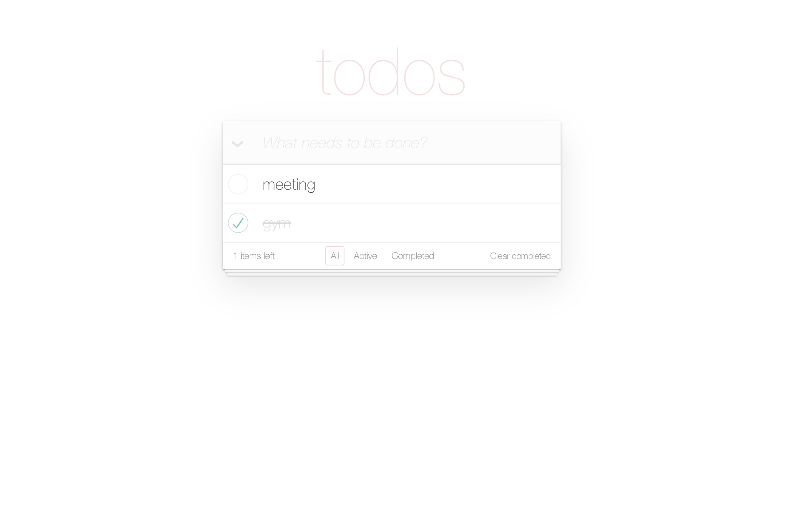
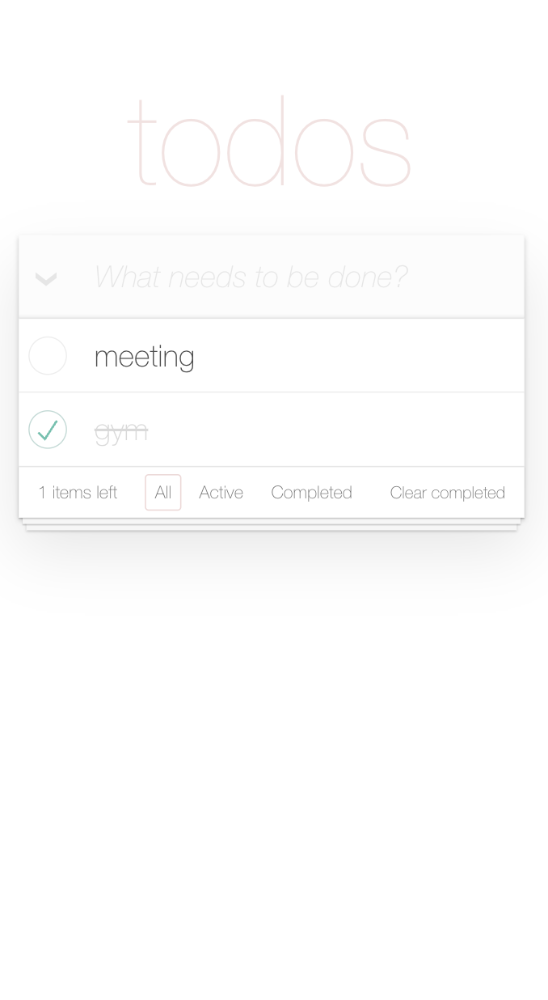

# Task Management App

This is a task management application designed and developed to provide a seamless experience for creating, updating, and managing tasks. The app is built using React and TypeScript and integrates with an API for dynamic task handling.

## Table of contents

- [Overview](#overview)
  - [The challenge](#the-challenge)
  - [Getting started](#getting-started)
  - [Screenshot](#screenshot)
  - [Links](#links)
- [My process](#my-process)
  - [Built with](#built-with)
  - [Features](#features)

## Overview

### The challenge

Users should be able to:

- Add, edit, and delete tasks dynamically through an API.
- Mark tasks as completed.
- View tasks in an organized, responsive layout.
- Filter tasks by status (e.g., all, completed, active).
- Delete all completed tasks.
- Receive feedback for API interactions, such as loading indicators and error messages.

### Getting Started

Prerequisites

To run this project locally, ensure you have the following installed:
-	Node.js: Version 16.x or higher
- npm: Comes with Node.js (used for installing dependencies)
- Git: For cloning the repository

Installation
- 1. Clone the Repository
      git clone git clone https://github.com/NKoshmak/task-management-app.git
- 2. Navigate to the Project Directory
      cd task-management-app
- 3. Install Dependencies
      npm install
- 4. Start the Development Server
      npm start
- 5. API Setup
      Update the API_URL in the file to match the API endpoint.
- 6. Open in Browser
      Open http://localhost:3000 to view the app in your browser.
- 7. Build project
      npm run build

### Screenshots

#### Desktop View

#### Mobile View

### Links

- [Solution URL](https://github.com/NKoshmak/task-management-app)
- [Live Site URL](https://nkoshmak.github.io/task-management-app/)

## My process

### Built with

- Languages: TypeScript, HTML5, CSS3, SCSS
- Frameworks: React
- Tools: GitHub, Chrome DevTools
- Techniques: Mobile-first design, state management using React Hooks, modular and reusable components

### Features

- Add tasks dynamically using an API.
- Edit and delete tasks with real-time updates.
- Filter tasks by their status (completed, active, all).
- Responsive design for a seamless experience across devices.
- Feedback for API interactions with loading spinners and error messages.
